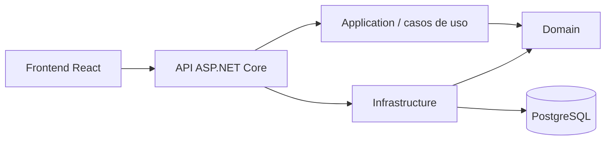

# Sistema de Gestão de Oficina Mecânica

Aplicação para administrar o ciclo operacional de uma oficina mecânica. A solução reúne uma API em .NET, um frontend React, persistência em PostgreSQL, ambiente local com Docker Compose e infraestrutura AWS provisionada com Terraform e Kubernetes.

## Ecossistema de repositórios

O projeto está distribuído por responsabilidade entre os seguintes repositórios:

| Repositório | Responsabilidade |
| --- | --- |
| [`fiap-tech-challenge`](https://github.com/Maieru/fiap-tech-challenge) | Aplicação principal: API .NET, frontend React, testes, Docker Compose, manifests das aplicações e orquestração dos workflows. |
| [`fiap-tech-challenge-infra`](https://github.com/Maieru/fiap-tech-challenge-infra) | Infraestrutura compartilhada: backend do Terraform, VPC, EKS, ECR, add-ons, configurações Kubernetes e observabilidade. |
| [`fiap-tech-challenge-db`](https://github.com/Maieru/fiap-tech-challenge-db) | Infraestrutura do PostgreSQL no Amazon RDS e credenciais do banco no AWS Secrets Manager. |
| [`fiap-tech-challenge-serverless`](https://github.com/Maieru/fiap-tech-challenge-serverless) | Repositório destinado aos componentes serverless do projeto. |

## Funcionalidades

- autenticação de usuários com JWT;
- cadastro e gestão de clientes e veículos;
- catálogo de serviços, peças e insumos, com controle de estoque;
- criação de ordens de serviço com cliente e veículo existentes ou cadastrados no próprio fluxo;
- diagnóstico, orçamento, aprovação, execução, finalização, entrega e cancelamento de ordens de serviço;
- acompanhamento público do andamento da ordem de serviço;
- registro do tempo gasto e cálculo do tempo médio dos serviços;
- exclusão lógica para preservação do histórico;
- interface administrativa responsiva para operação dos principais fluxos.

## Arquitetura

Uma visão visual completa da infraestrutura AWS, da organização dos pods no EKS e das camadas da aplicação está disponível em [`docs/ARQUITETURA.md`](docs/ARQUITETURA.md).

O backend é um monólito modular organizado em camadas, com as regras de negócio isoladas dos detalhes de persistência e entrega HTTP:



- **API:** controllers, autenticação, OpenAPI e composição da aplicação;
- **Application:** casos de uso e contratos de entrada e saída;
- **Domain:** entidades, value objects, enums, interfaces e regras de negócio;
- **Infrastructure:** Entity Framework Core, repositórios, migrations, JWT e serviços externos;
- **Frontend:** aplicação React com rotas protegidas, consumo da API e telas administrativas.

A API aplica automaticamente as migrations pendentes na inicialização, exceto no ambiente de testes.

## Tecnologias

- .NET 10, ASP.NET Core e Entity Framework Core;
- PostgreSQL e Npgsql;
- JWT e BCrypt;
- React 19, TypeScript, Vite e Tailwind CSS;
- Docker, Docker Compose e Nginx;
- Terraform, AWS, API Gateway, Application Load Balancer e Kubernetes;
- Scalar e OpenAPI;
- NUnit, Moq e FluentAssertions.

## Execução local com Docker Compose

### Pré-requisitos

- Docker com Docker Compose;
- portas `5173`, `8080`, `5050` e `5432` disponíveis.

Na raiz do repositório, execute:

```bash
docker compose -f src/docker-compose.yml up --build -d
```

Serviços disponíveis:

| Serviço | Endereço | Credenciais locais |
| --- | --- | --- |
| Frontend | `http://localhost:5173` | — |
| API | `http://localhost:8080` | — |
| Scalar | `http://localhost:8080/scalar/v1` | — |
| OpenAPI | `http://localhost:8080/openapi/v1.json` | — |
| Liveness | `http://localhost:8080/api/health/live` | — |
| Readiness | `http://localhost:8080/api/health/ready` | — |
| PostgreSQL | `localhost:5432` | `postgres / postgres` |
| PgAdmin | `http://localhost:5050` | `admin@admin.com / admin` |

As credenciais e chaves presentes no Compose são destinadas apenas ao desenvolvimento local.

Para encerrar os serviços:

```bash
docker compose -f src/docker-compose.yml down
```

## Execução sem Docker

### Backend

Requer o SDK .NET 10 e uma instância PostgreSQL acessível. Configure `ConnectionStrings:DefaultConnection` e as opções `Jwt` por `appsettings`, variáveis de ambiente ou User Secrets e execute:

```bash
dotnet run --project src/FIAP.TechChallenge.Fase1.API
```

### Frontend

Requer Node.js 22 ou superior. A partir da raiz do repositório:

```bash
cd src/FIAP.TechChallenge.Fase1.Frontend
npm install
npm run dev
```

Para apontar o frontend para uma API executada separadamente, crie um arquivo `.env` no diretório do frontend:

```env
VITE_API_BASE_URL=http://localhost:8080/api
```

No Visual Studio, abra `src/TechChallengeFase1.slnx`. Para iniciar todo o ambiente em contêineres, selecione o projeto `docker-compose` como projeto de inicialização.

## Autenticação e documentação da API

Em ambiente de desenvolvimento, a especificação OpenAPI e a interface Scalar ficam disponíveis nos endereços indicados acima.

O fluxo de autenticação é:

1. criar um usuário em `POST /api/usuarios`;
2. autenticar em `POST /api/usuarios/login`;
3. enviar o token retornado nas requisições protegidas:

```http
Authorization: Bearer <token>
```

Além do cadastro e login, são públicos os health checks e `GET /api/ordensservico/acompanhamento/{id}`. Os demais endpoints exigem autenticação.

## Fluxo da ordem de serviço

O fluxo principal de status é:

```text
Recebida → EmDiagnostico → AguardandoAprovacao → EmExecucao → Finalizada → Entregue
```

Uma ordem também pode assumir o status `Cancelada`, conforme as regras do domínio.

Regras importantes:

- serviços e peças ou insumos só podem ser adicionados durante o diagnóstico;
- a execução depende da aprovação do orçamento por código de aprovação;
- serviços só podem ser concluídos enquanto a ordem está em execução;
- a ordem só pode ser finalizada após a conclusão de todos os serviços;
- a entrega só pode ocorrer depois da finalização;
- os itens vinculados à ordem preservam um snapshot dos dados e valores do momento da inclusão.

## Infraestrutura e Kubernetes

A infraestrutura de produção é declarada em Terraform nos repositórios [`fiap-tech-challenge-infra`](https://github.com/Maieru/fiap-tech-challenge-infra) e [`fiap-tech-challenge-db`](https://github.com/Maieru/fiap-tech-challenge-db). Ela provisiona, na região `us-east-1`, uma VPC, um cluster Amazon EKS, PostgreSQL no Amazon RDS, repositórios Amazon ECR, Secrets Manager, backend remoto no S3 e autenticação OIDC para as pipelines do GitHub Actions.

Os manifests em `k8s` implantam backend e frontend em namespaces separados. O backend possui uma réplica inicial, probes de saúde, limites de recursos e HPA de 1 a 10 pods; seus segredos são sincronizados do AWS Secrets Manager pelo External Secrets. Os dois serviços são `ClusterIP` e participam do mesmo `IngressGroup`: o AWS Load Balancer Controller cria um ALB interno que encaminha `/api/*` ao backend e as demais rotas ao frontend. Um API Gateway HTTP API é a entrada pública e acessa esse ALB por um VPC Link.

Os módulos Terraform devem ser aplicados nesta ordem:

```text
bootstrap → aws-resources → database → kubernetes-addons → kubernetes-configs
→ deploy das aplicações e Ingresses → api-gateway
```

Os estágios `bootstrap`, `aws-resources`, `kubernetes-addons`, `kubernetes-configs` e `api-gateway` pertencem ao repositório de infraestrutura; `database` pertence ao repositório de banco. Cada repositório contém sua própria action reutilizável `terraform-stage` e seus workflows de criação e destruição. Este repositório orquestra as chamadas remotas, constrói as imagens, implanta as aplicações, aguarda a criação do ALB e então aplica o API Gateway.

O fluxo completo executa:

```text
Infra/Core → Database → Infra/Kubernetes → Build → Deploy/ALB → API Gateway
```

Na destruição, o orquestrador preserva as dependências entre os estados:

```text
Kubernetes Configs → Kubernetes Add-ons → Database → EKS
```

O passo a passo operacional está no [`guia de infraestrutura`](https://github.com/Maieru/fiap-tech-challenge-infra/tree/main/infra) e no [`guia do banco`](https://github.com/Maieru/fiap-tech-challenge-db#readme). A organização dos manifests, o deploy manual e os comandos de diagnóstico estão em [`k8s/README.md`](k8s/README.md).

Para a orquestração, configure os secrets `INFRA_ACTION_ROLE`, `DATABASE_ACTION_ROLE`, `ACTION_ROLE_ARN`, `jwt_signing_key`, `db_username` e `db_password`. Se os repositórios forem privados, configure também `REPOSITORIES_TOKEN` com acesso de leitura aos repositórios chamados.

## Testes

A solução contém testes de domínio, casos de uso, infraestrutura e API. Para executar toda a suíte:

```bash
dotnet test src/TechChallengeFase1.slnx
```

## Estrutura do repositório

```text
.
├── .github/workflows/   # CI/CD, infraestrutura e deploy
├── docs/                # documentação de arquitetura
├── k8s/                 # manifests do backend e frontend
└── src/                 # solução .NET, frontend e Docker Compose
```

## Observações Finais

Este projeto foi construído com foco em:

- aplicar princípios de DDD na modelagem do domínio;
- manter uma separação clara de responsabilidades entre as camadas;
- experimentar, na prática, o conceito de domínio rico;
- proteger as regras de negócio dos detalhes de infraestrutura e apresentação;
- oferecer uma experiência completa, da interface administrativa à persistência dos dados;
- facilitar a execução local, os testes, a avaliação e a evolução futura do sistema;
- aplicar infraestrutura como código e automatizar o provisionamento e o deploy;
- explorar a execução em nuvem com AWS e a orquestração de aplicações com Kubernetes.

Este é meu primeiro projeto em que aplico esses conceitos de forma tão abrangente, cobrindo não apenas a modelagem e a implementação da aplicação, mas também frontend, conteinerização, infraestrutura e entrega contínua.
