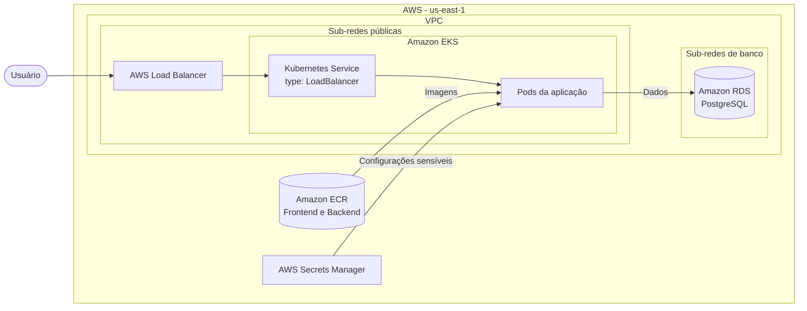
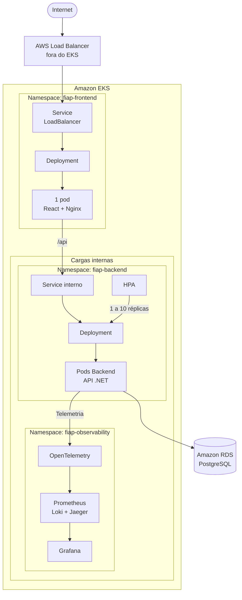

# Arquitetura da solução

Este documento apresenta uma visão simplificada da infraestrutura AWS, da organização das cargas no Amazon EKS e das camadas da aplicação.

## Infraestrutura AWS

O AWS Load Balancer fica fora do EKS e encaminha o tráfego para o `Service` Kubernetes do frontend. O backend e os componentes de observabilidade permanecem acessíveis apenas dentro do cluster.

## Organização dos pods no EKS

Os pods podem ser distribuídos entre os nós do node group gerenciado pelo EKS. O frontend mantém uma réplica; o backend começa com uma e pode escalar até dez conforme o uso de CPU.

## Camadas da aplicação

O `Domain` concentra as regras de negócio e não depende das demais camadas. A `Application` coordena os casos de uso, a `API` expõe as operações por HTTP e a `Infrastructure` implementa persistência e integrações externas.
