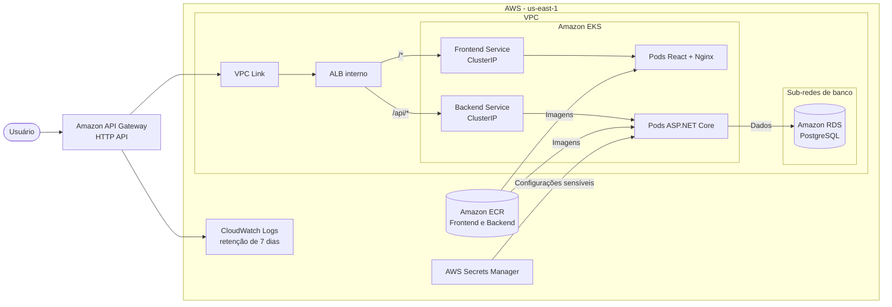
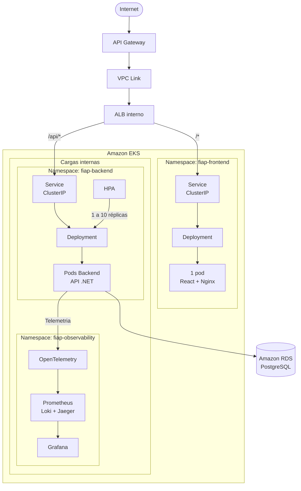
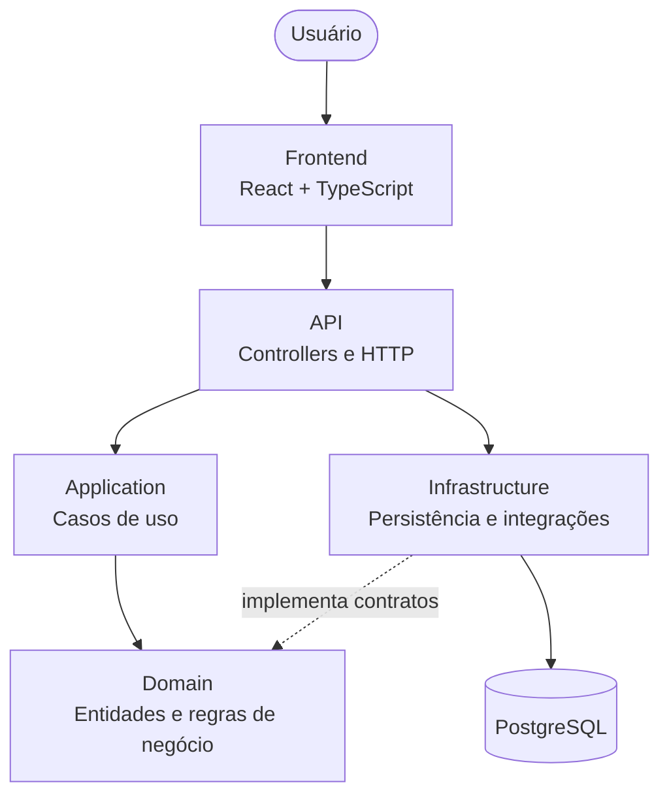

# Arquitetura da solução

Este documento apresenta uma visão simplificada da infraestrutura AWS, da organização das cargas no Amazon EKS e das camadas da aplicação.

## Infraestrutura AWS

O API Gateway é o único endpoint público. Seu VPC Link acessa o listener HTTP do ALB interno, que usa regras por caminho e target groups independentes para frontend e backend. Os services Kubernetes e os componentes de observabilidade permanecem privados.

## Organização dos pods no EKS

O AWS Load Balancer Controller registra diretamente os IPs dos pods nos target groups do ALB. O frontend mantém uma réplica; o backend começa com uma e pode escalar até dez conforme o uso de CPU.

## Camadas da aplicação

O `Domain` concentra as regras de negócio e não depende das demais camadas. A `Application` coordena os casos de uso, a `API` expõe as operações por HTTP e a `Infrastructure` implementa persistência e integrações externas.
