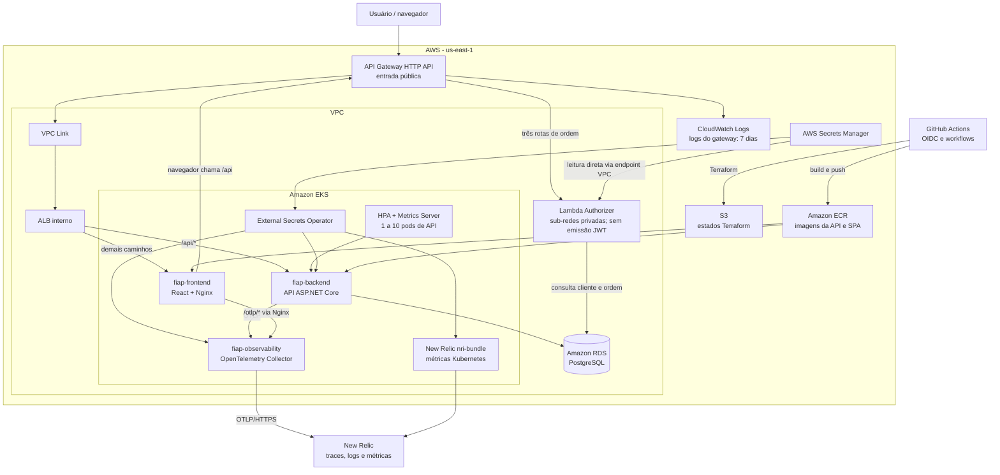
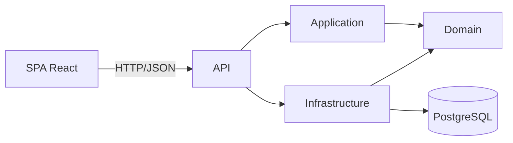

# Arquitetura da solução

A aplicação usa AWS, Kubernetes e PostgreSQL, com telemetria no New Relic. Esta visão descreve o código e a infraestrutura declarada; não comprova um deploy ativo. As limitações estão descritas junto de cada componente.

## Diagrama de componentes

O authorizer executa em sub-redes privadas e autoriza as rotas declaradas de acompanhamento, aprovação e cancelamento. Ele retorna `isAuthorized`; o JWT administrativo é emitido pela API. O fluxo CPF → JWT exigido pela Fase 3 ainda não está implementado.

## Entrada e isolamento

- API Gateway encaminha requisições pelo VPC Link ao listener HTTP do ALB interno.
- Os Ingresses compartilham o grupo `fiap-edge`; os services são `ClusterIP`, e o controller registra IPs dos pods nos target groups.
- O Nginx encaminha `/otlp/*` ao Collector sem autenticação específica.
- O RDS está marcado como publicamente acessível, com regras de entrada para EKS e Lambda. Os nós EKS usam sub-redes públicas; o endpoint de controle tem acesso público e privado.
- Namespaces separam a organização das cargas, sem NetworkPolicy declarada para isolamento de tráfego.

## Cargas e disponibilidade

| Carga | Configuração atual |
| --- | --- |
| Frontend | Uma réplica |
| Backend | HPA de 1 a 10 réplicas, alvo de 70% do request de CPU |
| Nós EKS | t3.small; mínimo 1, desejado 3, máximo 4; sem autoscaler de nós |
| Saúde da API | Startup/liveness em `/api/health/live`; readiness com consulta ao banco em `/api/health/ready` |
| Observabilidade | Collector e integração Kubernetes no namespace fiap-observability |

O ambiente é destruído diariamente para reduzir custos. HPA e probes não comprovam alta disponibilidade; o perfil é de laboratório, conforme a [ADR-010](../ADRs/ADR-010-ambiente-efemero-orientado-a-custo.md).

## Camadas da aplicação

Domain concentra entidades e regras; Application coordena casos de uso; API traduz HTTP e compõe dependências; Infrastructure implementa persistência e integrações. O backend é uma unidade de implantação. A Lambda tem contexto EF de leitura próprio e compartilha o schema do banco.

## Documentos relacionados

- [Sequências de autenticação e abertura de ordem](sequencias.md).
- [Modelo ER, relacionamentos e evolução do banco](banco-de-dados.md).
- [Observabilidade e validação](../operacao/observabilidade.md).
- [Estados e repositórios](../ADRs/ADR-008-estados-terraform-e-repositorios.md).
- [Escolhas técnicas](../RFCs/README.md) e [decisões arquiteturais](../ADRs/README.md).
