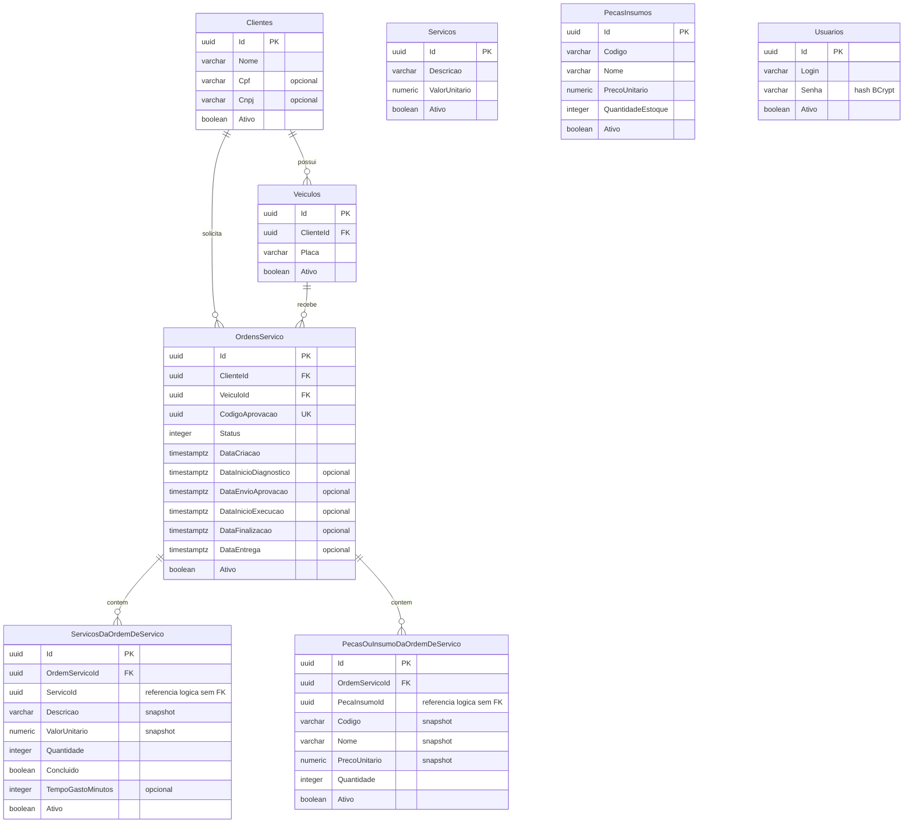

# Banco de dados e modelo relacional

## Escolha do banco

PostgreSQL atende aos relacionamentos, chaves estrangeiras e transações da oficina. EF Core/Npgsql mantém o acesso e as migrations junto da aplicação; Amazon RDS reduz a operação do servidor na AWS. A [RFC-002](../RFCs/RFC-002-postgresql-no-amazon-rds.md) registra alternativas e consequências.

## Diagrama ER físico

O diagrama apresenta as oito tabelas e as chaves estrangeiras do snapshot EF atual. Atributos descritivos foram abreviados; o [snapshot completo](../../src/FIAP.TechChallenge.Fase1.Infrastructure/Migrations/AppDbContextModelSnapshot.cs) é a referência dos tipos e nulabilidade.

## Relacionamentos e consistência

- Um cliente pode ter vários veículos e ordens. Cada veículo e ordem referencia exatamente um cliente.
- Um veículo pode aparecer em várias ordens. A API valida que o veículo pertence ao cliente informado; as FKs isoladas não garantem essa combinação.
- Cada ordem tem zero ou mais serviços e peças vinculados. Cada item pertence a uma ordem.
- `ServicoId` e `PecaInsumoId` identificam a origem no catálogo, mas não possuem FK no snapshot. Os casos de uso consultam o catálogo e copiam os dados do item.
- `Usuarios` representa contas administrativas, sem FK para `Clientes`.
- Valores monetários usam precisão de duas casas. Timestamps das etapas permitem medir duração; não há histórico de todas as mudanças de status.
- As FKs declaradas usam exclusão física em cascata. O fluxo normal usa exclusão lógica; uma remoção física excepcional exige revisar esse efeito.

## Justificativa dos ajustes realizados

A justificativa abaixo é retrospectiva, baseada nas migrations e no uso atual; não atribui às mudanças uma discussão histórica não registrada.

| Ajuste existente | Justificativa e consequência | Evidência |
| --- | --- | --- |
| Itens separados da ordem com snapshots | Permite vários itens e conserva descrição/preço contratados mesmo após alteração do catálogo. Duplica dados intencionalmente. | [AddEntidadesDeOrdemServico](../../src/FIAP.TechChallenge.Fase1.Infrastructure/Migrations/20260412144027_AddEntidadesDeOrdemServico.cs), [ADR-004](../ADRs/ADR-004-preservacao-do-historico.md) |
| FKs de cliente/veículo e índices associados | Garante existência dos registros referenciados e oferece índices para joins e buscas por vínculo. Não comprova ganho medido de performance. | [FixForeignKeys](../../src/FIAP.TechChallenge.Fase1.Infrastructure/Migrations/20260412145312_FixForeignKeys.cs) |
| Concluido e TempoGastoMinutos no serviço executado | Separa execução da ordem do cadastro do serviço e permite registrar conclusão e esforço por item. | [AddCampoTempoGastoEmServico](../../src/FIAP.TechChallenge.Fase1.Infrastructure/Migrations/20260419150541_AddCampoTempoGastoEmServico.cs) |
| Ativo com padrão true | Preserva registros por exclusão lógica; filtros ocultam inativos nas consultas normais. | [AddSoftDelete](../../src/FIAP.TechChallenge.Fase1.Infrastructure/Migrations/20260425135900_AddSoftDelete.cs), [AppDbContext](../../src/FIAP.TechChallenge.Fase1.Infrastructure/Persistence/AppDbContext.cs) |
| CodigoAprovacao UUID com índice único | Individualiza o código da ordem e impede duplicação no banco; hoje participa do token SHA-256. Não é JWT. | [AddCodigoAprovacaoOrdemServico](../../src/FIAP.TechChallenge.Fase1.Infrastructure/Migrations/20260705170631_AddCodigoAprovacaoOrdemServico.cs) |

## Índices e limites atuais

Há índices nas FKs de cliente, veículo e ordem, além do índice único de `CodigoAprovacao`. O snapshot não declara unicidade para CPF, CNPJ, login ou placa, nem índice específico de status/data. Uma autenticação por CPF precisa definir comportamento para duplicidade e clientes sem CPF antes de ser implementada.

As transações dos fluxos compostos e sua lacuna atual estão na [ADR-003](../ADRs/ADR-003-persistencia-por-repositorios.md). Cliente e veículo não têm snapshot na ordem, portanto inativação pode prejudicar o acesso histórico.

Não foi apresentada medição de performance do banco. Para justificar novos índices, registrar consulta, volume de dados, plano `EXPLAIN (ANALYZE, BUFFERS)` em ambiente de teste e comparação antes/depois. As migrations listadas são mudanças já existentes, não novas otimizações realizadas nesta revisão.

## Operação

O [repositório de banco](https://github.com/Maieru/fiap-tech-challenge-db) provisiona RDS e segredo; o schema pertence às migrations da aplicação. A Lambda usa contexto EF de leitura próprio no mesmo banco. Alterações devem ser compatíveis com ambos os consumidores.

PostgreSQL local é 16 e RDS está configurado como 18.3. Migrations executam no startup da API. O ambiente atual não tem backups automáticos nem snapshot final e é destruído diariamente; não atende à operação corporativa durável sem novas mudanças.
