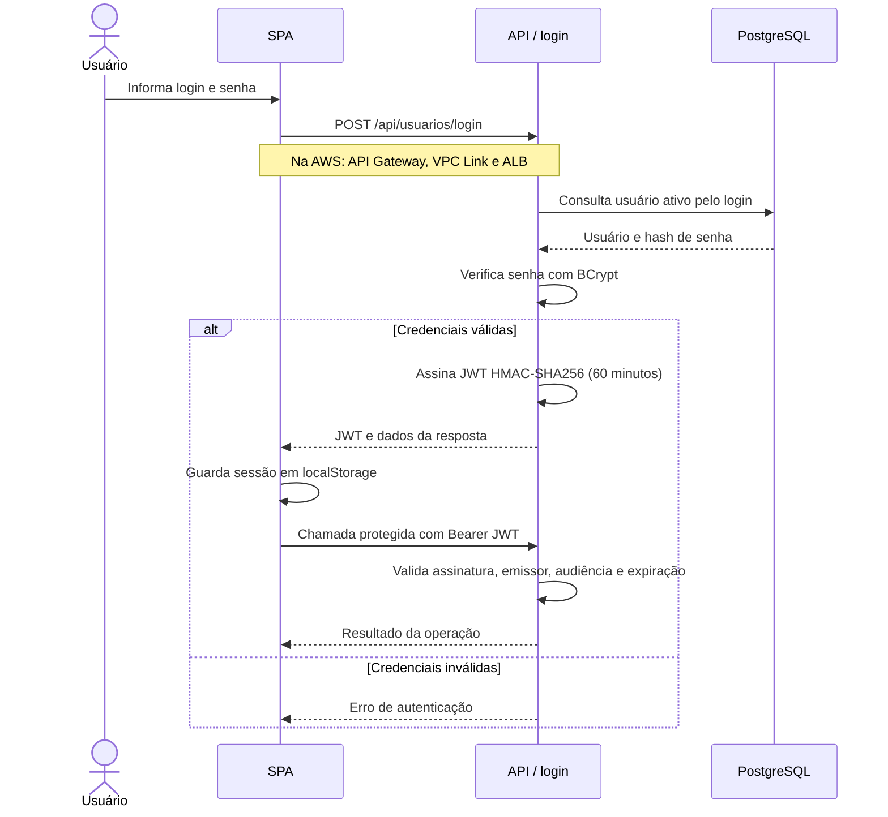
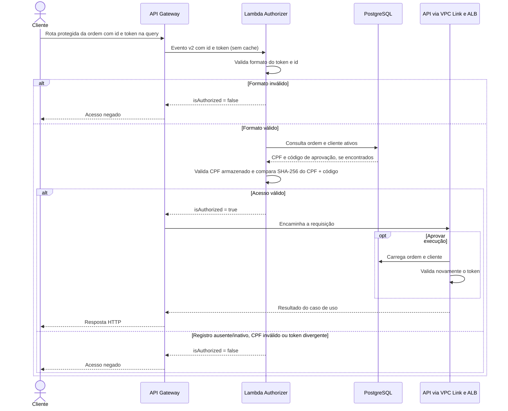
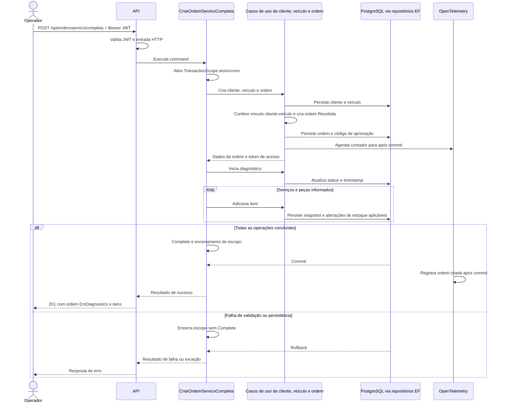

# Sequências dos fluxos principais

Os diagramas descrevem a implementação atual: autenticação administrativa na API, validação das requisições dos clientes pela Lambda e abertura de ordens.

## Autenticação administrativa atual

Este fluxo autentica os usuários administrativos por login e senha, com JWT emitido pela API.

## Acesso atual do cliente à ordem na AWS

Conforme o alinhamento do projeto, a Lambda atua como authorizer do API Gateway: valida o acesso do cliente à ordem e devolve a decisão de autorização. A emissão de JWT permanece no fluxo administrativo da API.

O token é gerado pela aplicação na criação da ordem quando o cliente tem CPF. Ele contém o SHA-256 do CPF normalizado concatenado ao código de aprovação da ordem. O cliente envia o identificador da ordem no caminho e o token na query string.

| Método | Rota validada pela Lambda |
| --- | --- |
| GET | `/api/ordensservico/acompanhamento/{id}` |
| PUT | `/api/ordensservico/{id}/aprovar-execucao` |
| PUT | `/api/ordensservico/{id}/cancelar` |

A Lambda verifica o formato do token e do identificador, consulta ordem e cliente ativos e compara o token com o valor esperado. Entradas inválidas são recusadas antes da consulta; registros ausentes/inativos, CPF inválido ou token divergente resultam em `isAuthorized = false`. Com acesso válido, retorna `isAuthorized = true`, e o gateway encaminha a requisição à API. A decisão não usa cache.

Acesso direto ao backend não executa esse controle; acompanhamento e cancelamento não repetem a validação do token na aplicação. A aprovação valida o token também no caso de uso.

## Abertura completa de ordem

A criação simples (`POST /api/ordensservico`) usa cliente e veículo existentes e retorna a ordem em `Recebida`. O fluxo `/com-cliente-veiculo` faz três gravações sem transação própria quando chamado diretamente; somente o fluxo completo acima abre o escopo externo.

## Evidências

- [Controllers](../../src/FIAP.TechChallenge.Fase1.API/Controllers).
- [Fluxo completo](../../src/FIAP.TechChallenge.Fase1.Application/UseCases/OrdensServico/CriarOrdemServicoCompleta/CriarOrdemServicoCompletaUseCase.cs).
- [Criação simples](../../src/FIAP.TechChallenge.Fase1.Application/UseCases/OrdensServico/CriarOrdemServico/CriarOrdemServicoUseCase.cs).
- [Fluxo com cliente e veículo](../../src/FIAP.TechChallenge.Fase1.Application/UseCases/OrdensServico/CriarOrdemServicoComClienteEVeiculo/CriarOrdemServicoComClienteEVeiculoUseCase.cs).
- [Lambda](https://github.com/Maieru/fiap-tech-challenge-serverless/tree/main/src/FIAP.TechChallenge.Serverless.OrdemServicoAuthorizer).
- [RFC-003](../RFCs/RFC-003-autenticacao-jwt-e-bcrypt.md).
