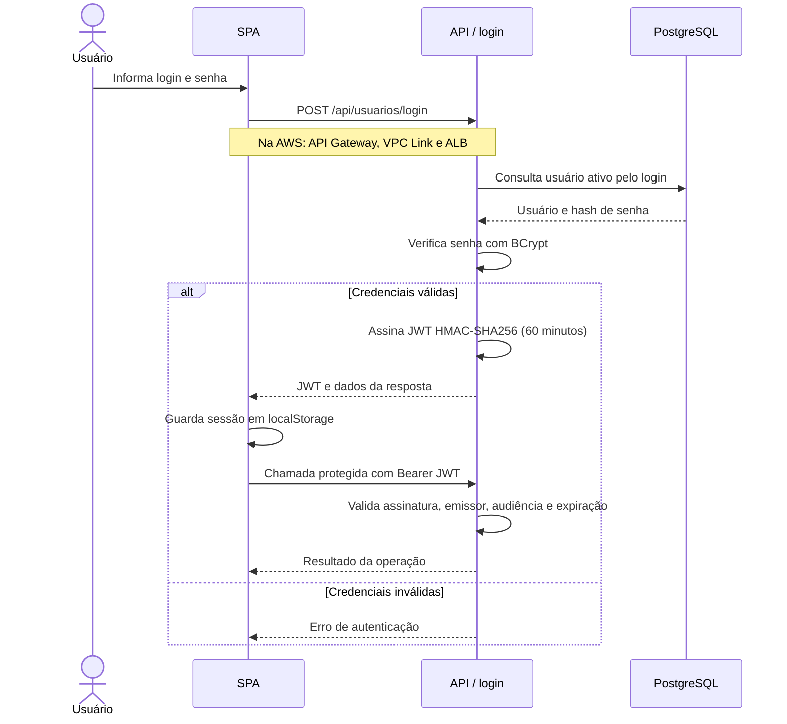
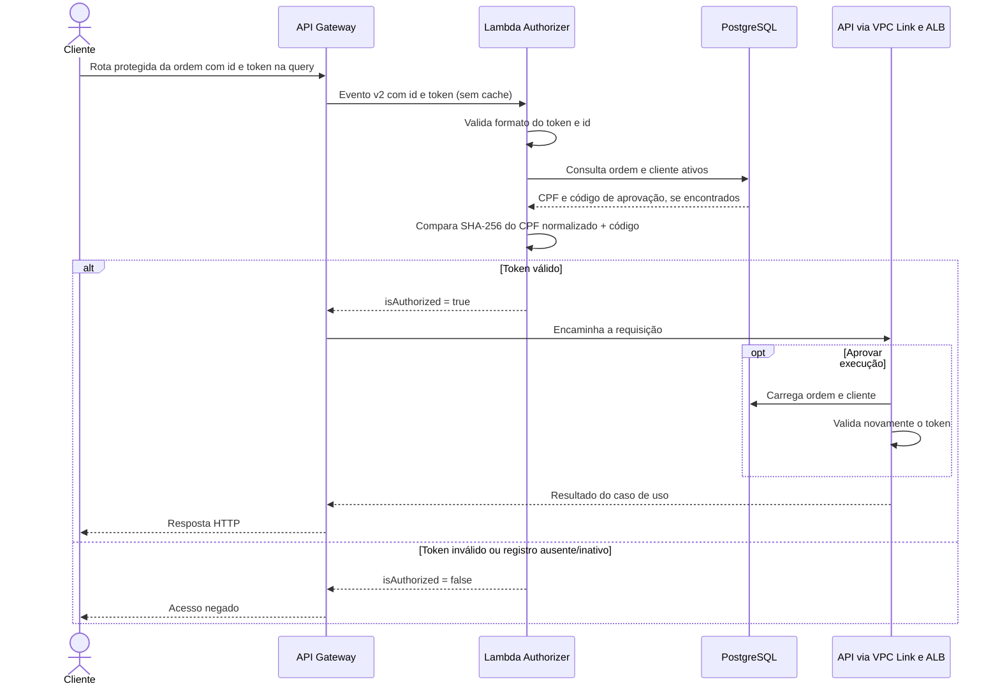
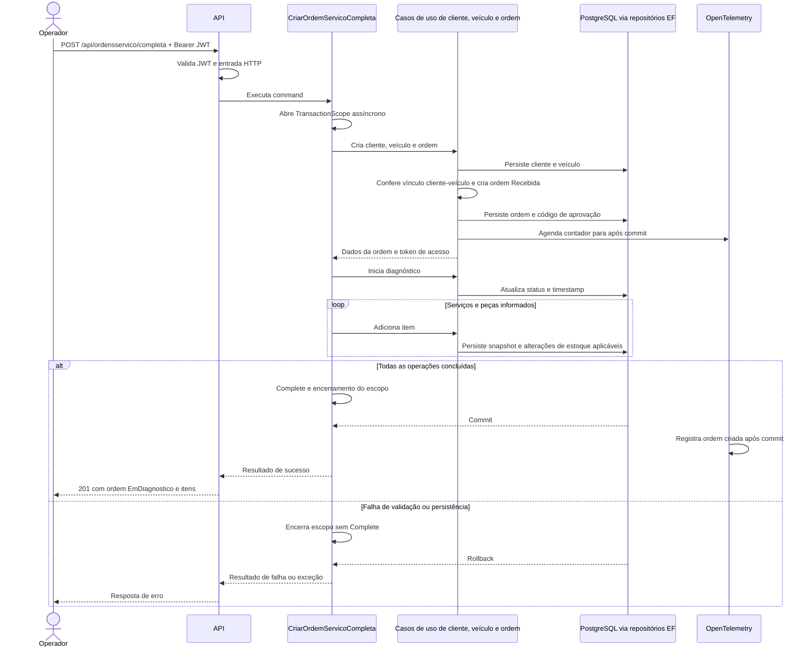
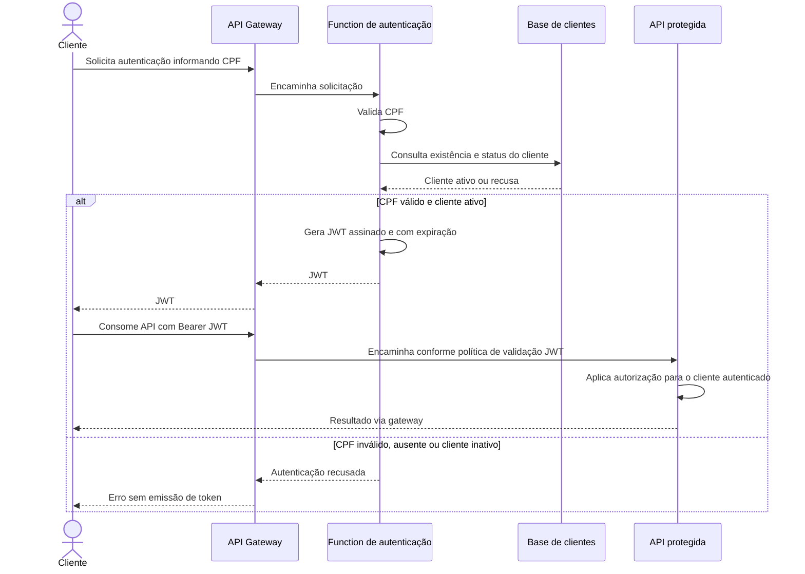

# Sequências dos fluxos principais

Os três primeiros diagramas descrevem a implementação atual. O último representa o requisito ainda não implementado da Fase 3.

## Autenticação administrativa atual

Este fluxo autentica `Usuarios`, não clientes por CPF. Ele não usa Lambda para emitir JWT.

## Acesso atual do cliente à ordem na AWS

O token é gerado na criação da ordem quando o cliente tem CPF e não é JWT. A proteção da Lambda se aplica às três rotas declaradas no gateway. Acesso direto ao backend não executa esse controle; acompanhamento e cancelamento não repetem a validação do token na aplicação.

## Abertura completa de ordem

A criação simples (`POST /api/ordensservico`) usa cliente e veículo existentes e retorna a ordem em `Recebida`. O fluxo `/com-cliente-veiculo` faz três gravações sem transação própria quando chamado diretamente; somente o fluxo completo acima abre o escopo externo.

## Autenticação por CPF exigida pela Fase 3 — pendente

Este diagrama transcreve o comportamento exigido; não define um endpoint já disponível nem uma decisão aceita. A implementação ainda deve definir contrato, assinatura, claims e escopo de acesso, e atualizar a RFC-003 junto da mudança.

## Evidências

- [Controllers](../../src/FIAP.TechChallenge.Fase1.API/Controllers).
- [Fluxo completo](../../src/FIAP.TechChallenge.Fase1.Application/UseCases/OrdensServico/CriarOrdemServicoCompleta/CriarOrdemServicoCompletaUseCase.cs).
- [Criação simples](../../src/FIAP.TechChallenge.Fase1.Application/UseCases/OrdensServico/CriarOrdemServico/CriarOrdemServicoUseCase.cs).
- [Fluxo com cliente e veículo](../../src/FIAP.TechChallenge.Fase1.Application/UseCases/OrdensServico/CriarOrdemServicoComClienteEVeiculo/CriarOrdemServicoComClienteEVeiculoUseCase.cs).
- [Lambda](https://github.com/Maieru/fiap-tech-challenge-serverless/tree/main/src/FIAP.TechChallenge.Serverless.OrdemServicoAuthorizer).
- [RFC-003](../RFCs/RFC-003-autenticacao-jwt-e-bcrypt.md).
