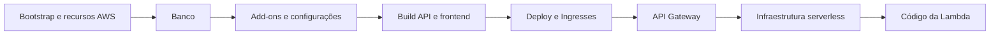

# Repositórios e CI/CD

## Estrutura atual

| Repositório | Validação e entrega declaradas | Execução |
| --- | --- | --- |
| [Aplicação](https://github.com/Maieru/fiap-tech-challenge/tree/main/.github/workflows) | Build das imagens, deploy Kubernetes e orquestração da plataforma | Orquestrador manual; etapas reutilizáveis |
| [Infraestrutura Kubernetes](https://github.com/Maieru/fiap-tech-challenge-infra/tree/main/.github/workflows) | Terraform fmt, validate, plan e apply dos estágios | Manual ou chamada por workflow |
| [Banco](https://github.com/Maieru/fiap-tech-challenge-db/tree/main/.github/workflows) | Terraform fmt, validate, plan e apply do RDS | Manual ou chamada por workflow |
| [Serverless](https://github.com/Maieru/fiap-tech-challenge-serverless/tree/main/.github/workflows) | Restore, build, testes, publicação ZIP e atualização da Lambda | Manual ou chamada por workflow |

A autenticação AWS usa OIDC. O apply usa o plano gerado, sem gate humano declarado. A existência desses workflows não comprova que foram executados com sucesso.

## Ordem de entrega

A [ADR-008](../ADRs/ADR-008-estados-terraform-e-repositorios.md) identifica responsáveis e estados. A destruição remove dependentes antes de gateway, banco e cluster.

## Melhorias pendentes de CI/CD

Os arquivos revisados não contêm gatilhos `pull_request` ou `push` para homologação/produção. Nomes como `production` em grupos de concorrência não criam ambientes separados.

Para automatizar a promoção entre homologação e produção, a implementação precisa:

- Definir as branches de homologação e produção e disparar deploy automaticamente após merge em cada uma.
- Exigir PR e checks antes de merge, bloquear push direto em main/master e verificar eventuais exceções administrativas.
- Executar validações de código ou Terraform no PR em cada repositório.
- Separar estados, recursos, configurações e segredos dos ambientes, evitando que um deploy sobrescreva o outro.
- Coordenar dependências entre repositórios e registrar a versão implantada.
- Demonstrar uma mudança promovida de homologação para produção com os checks e deploys concluídos.

Os nomes exatos das branches e a estratégia de isolamento ainda precisam ser definidos; esta lista descreve requisitos, não uma política já configurada.

## Evidências de validação

Após implementar o fluxo, registrar por repositório: regras efetivas de proteção, PR aprovado, checks, execução do deploy de cada ambiente e versão resultante. O acesso às configurações remotas do GitHub não foi verificado nesta revisão.

Referências: [RFC-005](../RFCs/RFC-005-terraform-e-github-actions-oidc.md) e [orquestrador](../../.github/workflows/initialize-and-deploy.yml).
