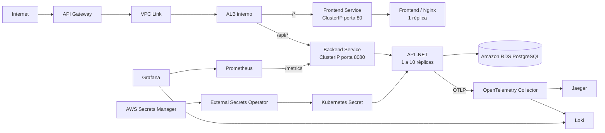

# Kubernetes

Esta pasta contém apenas os manifests Kubernetes das aplicações backend e frontend. Namespaces, `SecretStore`, add-ons e observabilidade pertencem ao repositório [`fiap-tech-challenge-infra`](https://github.com/Maieru/fiap-tech-challenge-infra).

## Arquitetura do deploy



O API Gateway é o único componente exposto publicamente. O AWS Load Balancer Controller combina os Ingresses dos dois namespaces em um ALB interno: `/api/*` segue para o backend e as demais rotas seguem para o frontend.

## Estrutura

```text
k8s/
├── backend/
│   ├── config-maps.yaml
│   ├── deployment.yaml
│   ├── hpa.yaml
│   ├── ingress.yaml
│   ├── secrets.yaml
│   └── services.yaml
└── frontend/
    ├── config-maps.yaml
    ├── deployment.yaml
    ├── ingress.yaml
    └── services.yaml
```

Os diretórios `backend` e `frontend` contêm somente os recursos que acompanham o ciclo de entrega da aplicação: configurações, segredos externos, deployments, serviços e escalabilidade.

A stack de observabilidade em produção é aplicada pelo módulo `infra/kubernetes-configs` do repositório de infraestrutura. `src/ObservabilityConfig` permanece neste repositório porque também é utilizado pelo ambiente local com Docker Compose.

## Recursos implantados

### Backend

O backend é executado no namespace `fiap-backend` e possui:

- `Deployment` com uma réplica inicial;
- imagem hospedada no Amazon ECR com `imagePullPolicy: Always`;
- `ConfigMap` com configurações do ASP.NET Core e do JWT;
- dois recursos `ExternalSecret`, que sincronizam as credenciais do banco e a chave JWT;
- `Service` do tipo `ClusterIP`, disponível internamente na porta `8080`;
- `Ingress` com a rota `/api`, target type `ip` e health check em `/api/health/ready`;
- startup e liveness probes no endpoint `/api/health/live`;
- readiness probe no endpoint `/api/health/ready`;
- requests de `100m` de CPU e `128Mi` de memória;
- limits de `500m` de CPU e `512Mi` de memória;
- `HorizontalPodAutoscaler` entre 1 e 10 réplicas, com alvo de 70% de utilização de CPU.

Os recursos `ExternalSecret` leem `fiap-secret-manager-database-credentials` e `fiap-secret-manager-jwt-signing-key` do AWS Secrets Manager. Os segredos são criados pelos repositórios Terraform correspondentes, e os valores sensíveis não ficam armazenados nos manifests.

### Frontend

O frontend é executado no namespace `fiap-frontend` e possui:

- `Deployment` com uma réplica;
- imagem hospedada no Amazon ECR com `imagePullPolicy: Always`;
- `ConfigMap` com o endereço interno do backend;
- requests de `100m` de CPU e `128Mi` de memória;
- limits de `500m` de CPU e `512Mi` de memória;
- `Service` do tipo `ClusterIP` na porta `80`;
- `Ingress` com a rota `/`, compartilhando o ALB interno com o backend.

## Pré-requisitos

Antes de aplicar os manifests da aplicação, é necessário ter:

- AWS CLI autenticada;
- `kubectl` instalado;
- cluster EKS `fiap-eks-cluster` criado;
- imagens do backend e do frontend publicadas nos respectivos repositórios ECR;
- External Secrets Operator, Metrics Server e AWS Load Balancer Controller instalados;
- namespaces `fiap-backend` e `fiap-frontend` criados;
- `SecretStore` `aws-secrets-store` disponível no namespace do backend;
- segredo `fiap-secret-manager-backend` disponível no AWS Secrets Manager.

Essas dependências são provisionadas pelos módulos Terraform nesta ordem:

```text
bootstrap → aws-resources → database → kubernetes-addons → kubernetes-configs
→ deploy das aplicações e Ingresses → api-gateway
```

Consulte o [`README` de infraestrutura](https://github.com/Maieru/fiap-tech-challenge-infra/tree/main/infra) para o procedimento completo de provisionamento.

## Deploy manual

Execute os comandos a partir da raiz do repositório.

### 1. Configurar o acesso ao cluster

```bash
aws eks update-kubeconfig --name fiap-eks-cluster --region us-east-1
kubectl get nodes
```

Prossiga quando os nós estiverem com status `Ready`.

### 2. Validar as dependências

```bash
kubectl get deployment external-secrets -n external-secrets
kubectl get deployment metrics-server -n kube-system
kubectl get namespaces fiap-backend fiap-frontend
kubectl get secretstore aws-secrets-store -n fiap-backend
```

### 3. Aplicar os manifests

```bash
kubectl apply -f k8s/backend
kubectl apply -f k8s/frontend
```

### 4. Aguardar o rollout

```bash
kubectl rollout status deployment/fiap-backend-deployment -n fiap-backend --timeout=5m
kubectl rollout status deployment/fiap-frontend-deployment -n fiap-frontend --timeout=5m
```

## Validação

Confira os principais recursos:

```bash
kubectl get pods,services -n fiap-backend
kubectl get pods,services -n fiap-frontend
kubectl get ingress -n fiap-backend
kubectl get ingress -n fiap-frontend
kubectl get hpa -n fiap-backend
kubectl get externalsecret -n fiap-backend
```

O `ExternalSecret` deve estar sincronizado e o Secret de destino deve existir:

```bash
kubectl describe externalsecret fiap-backend-secret -n fiap-backend
kubectl get secret fiap-backend-secret -n fiap-backend
```

Os dois Ingresses devem apresentar o mesmo hostname interno:

```bash
kubectl get ingress fiap-backend-ingress -n fiap-backend
kubectl get ingress fiap-frontend-ingress -n fiap-frontend
```

Depois de aplicar o estado `infra/api-gateway`, consulte o endpoint público no repositório de infraestrutura:

```bash
terraform -chdir=infra/api-gateway output -raw api_endpoint
```

Também é possível validar os serviços por port-forward:

```bash
kubectl port-forward service/fiap-frontend-service 8081:80 -n fiap-frontend
kubectl port-forward service/fiap-backend-service 8080:8080 -n fiap-backend
```

Com os comandos executados separadamente, o frontend fica disponível em `http://localhost:8081`, a liveness do backend em `http://localhost:8080/api/health/live` e a readiness em `http://localhost:8080/api/health/ready`.

## Deploy pelo GitHub Actions

O workflow `.github/workflows/deploy-applications.yml` realiza o deploy no EKS. Ele:

1. autentica na AWS via OIDC;
2. atualiza o `kubeconfig` do cluster;
3. verifica as permissões no Kubernetes;
4. reinicia e aguarda o External Secrets Operator;
5. aplica os manifests de `k8s/backend` e `k8s/frontend`;
6. reinicia os deployments para buscar as imagens marcadas como `latest`;
7. aguarda a conclusão dos rollouts e a criação do ALB interno.

O workflow `.github/workflows/initialize-and-deploy.yml` coordena o processo completo: aplica a infraestrutura, publica as imagens, implanta as aplicações, aguarda o ALB e aplica o API Gateway.

## Configurações que exigem atenção

- as imagens dos deployments contêm o ID da conta AWS e a região do ECR; ajuste os endereços se o ambiente mudar;
- os manifests usam a tag `latest`, enquanto as pipelines também publicam uma tag imutável com o SHA do commit;
- o backend está configurado com `ASPNETCORE_ENVIRONMENT=Development`; revise esse valor antes de utilizar os manifests em um ambiente de produção;
- o HPA depende do Metrics Server para obter as métricas de CPU;
- o ALB depende do AWS Load Balancer Controller, da Pod Identity e das sub-redes privadas marcadas para load balancers internos;
- o External Secrets depende da associação de identidade do pod e das permissões IAM criadas pelo Terraform;
- a criação do Secret pode levar alguns instantes após a aplicação do `ExternalSecret`.

## Diagnóstico de problemas

### Pods e eventos

```bash
kubectl get pods -A
kubectl get events -n fiap-backend --sort-by=.metadata.creationTimestamp
kubectl get events -n fiap-frontend --sort-by=.metadata.creationTimestamp
```

### Logs

```bash
kubectl logs deployment/fiap-backend-deployment -n fiap-backend --tail=200
kubectl logs deployment/fiap-frontend-deployment -n fiap-frontend --tail=200
kubectl logs deployment/external-secrets -n external-secrets --tail=200
kubectl logs deployment/aws-load-balancer-controller -n kube-system --tail=200
```

### Métricas e escalabilidade

```bash
kubectl top pods -n fiap-backend
kubectl describe hpa fiap-backend-hpa -n fiap-backend
```

Se o backend não iniciar, verifique primeiro o `ExternalSecret`, o Secret gerado e a conectividade com o RDS. Se o API Gateway responder com erro de integração, valide o VPC Link, os eventos dos Ingresses, a saúde dos target groups e os logs do AWS Load Balancer Controller.

## Remoção das aplicações

Destrua primeiro o estado `infra/api-gateway`, a partir do repositório de infraestrutura, e então remova as cargas da aplicação, preservando o cluster:

```bash
terraform -chdir=infra/api-gateway destroy
kubectl delete -f k8s/frontend
kubectl delete -f k8s/backend
```

Namespaces, add-ons, identidades AWS e demais recursos de infraestrutura devem ser removidos por meio dos respectivos módulos Terraform, conforme o procedimento descrito no [`README` de infraestrutura](https://github.com/Maieru/fiap-tech-challenge-infra/tree/main/infra).
