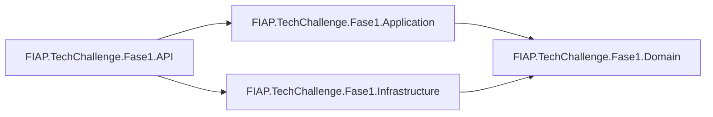

# FIAP Tech Challenge Fase 1

Sistema de gestao para oficina mecanica, com backend em camadas (API + Application + Domain + Infrastructure), persistencia em PostgreSQL e frontend React (projeto separado dentro da mesma solucao).

## Visao Geral

O sistema cobre o ciclo operacional de oficina:

- cadastro de clientes e veiculos;
- catalogo de servicos e pecas/insumos;
- abertura e acompanhamento de ordens de servico;
- autenticacao de usuarios com JWT.

Fluxo tecnico (resumido):

1. `Controller` recebe a requisicao HTTP.
2. `UseCase` aplica regras de negocio.
3. `Repository` (interface no dominio) abstrai persistencia.
4. `Infrastructure` implementa repositorios com EF Core.
5. dados sao persistidos no PostgreSQL.

As migracoes do banco sao aplicadas automaticamente na inicializacao da API.

## Dependencias Do Projeto

### Dependencias de ambiente

- Docker + Docker Compose (para subir backend e banco localmente).
- SDK .NET 10 (se quiser rodar fora do Docker).
- Node.js (somente para rodar o frontend fora do Docker).

### Dependencias entre projetos da solucao

- `FIAP.TechChallenge.Fase1.API`
  - depende de `Application` e `Infrastructure`.
- `FIAP.TechChallenge.Fase1.Application`
  - depende de `Domain` (dominio/contratos).
- `FIAP.TechChallenge.Fase1.Infrastructure`
  - depende de `Domain` e implementa persistencia, seguranca e servicos externos.
- `FIAP.TechChallenge.Fase1.Domain`
  - nucleo de dominio (entidades, value objects, enums e interfaces).
- projetos `*.Tests`
  - cobrem API, Application, Domain e Infrastructure.

### Diagrama de dependencias (Mermaid)



## Testes

O projeto possui cobertura de testes unitários e de integração, incluindo alguns cenários que percorrem ponta a ponta o fluxo de negocio.

## Escolha Do Banco De Dados

O PostgreSQL foi escolhido por ser um **banco de dados relacional robusto, gratuito e de código aberto**, com suporte fácil via Docker, boa integração com aplicações C#/.NET por meio do provider Npgsql e recursos adequados para garantir a integridade e a consistência dos dados em um sistema transacional como o de gestão de ordens de serviço, clientes, veículos, peças e estoque.

## Servicos No Docker Compose

O `docker-compose.yml` sobe:

- `fiap-techchallenge-api` (API .NET) em `http://localhost:8080`
- `fiap-techchallenge-db` (PostgreSQL) em `localhost:5432`
- `fiap-techchallenge-pgadmin` (opcional, gestao do banco) em `http://localhost:5050`

Credenciais padrao no compose:

- PostgreSQL: `postgres/postgres`
- PgAdmin: `admin@admin.com` / `admin`

## Como Rodar Local Com Docker Compose

Na raiz da solucao (`src`), execute:

```bash
docker compose -f docker-compose.yml up --build -d
```

## Como Rodar Local Dentro do Visual Studio

Abra a solução `TechChallengeFase1` dentro do Visual Studio e selecione o projeto `docker-compose` como startup Project. 

## Regras de Negócio

### Autenticacao

- endpoints de usuario (`/api/usuarios` e `/api/usuarios/login`) sao publicos;
- demais endpoints exigem token JWT (`Authorization: Bearer <token>`).

### Fluxo de ordem de servico

A entidade `OrdemServico` implementa o fluxo:

1. `Recebida`
2. `EmDiagnostico`
3. `AguardandoAprovacao`
4. `EmExecucao`
5. `Finalizada`
6. `Entregue`

Regras importantes:

- so adiciona servicos/pecas em diagnostico;
- so conclui servico quando a OS esta em execucao;
- so finaliza quando todos os servicos da OS foram concluidos;
- so entrega quando a OS ja esta finalizada.

## Entidades Criadas

### Nucleo

- `Cliente`: dados do cliente (CPF/CNPJ, contato).
- `Veiculo`: vinculo com cliente, placa, marca/modelo/ano.
- `Usuario`: login e senha criptografada.

### Catalogo administrativo

- `Servico`: servicos cadastraveis (descricao e valor unitario).
- `PecaInsumo`: pecas/insumos de estoque (codigo, preco, quantidade, ativo).

### Operacao da oficina

- `OrdemServico`: processo completo de atendimento.
- `ServicoDaOrdemDeServico`: snapshot de servico aplicado na OS (inclui tempo gasto/conclusao).
- `PecaOuInsumoDaOrdemDeServico`: snapshot de peca/insumo aplicado na OS.

Relacoes principais:

- 1 cliente -> N veiculos
- 1 cliente -> N ordens de servico
- 1 veiculo -> N ordens de servico
- 1 ordem de servico -> N servicos da ordem
- 1 ordem de servico -> N pecas/insumos da ordem

## Frontend (Opcional)

Existe frontend em `FIAP.TechChallenge.Fase1.Frontend`, mas ele nao esta no `docker-compose.yml` atual.

Para rodar frontend local:

```bash
cd FIAP.TechChallenge.Fase1.Frontend
npm install
npm run dev
```

Se o backend estiver via Docker em `http://localhost:8080`, ajuste o `.env` do frontend para:

```env
VITE_API_BASE_URL=http://localhost:8080/api
```
